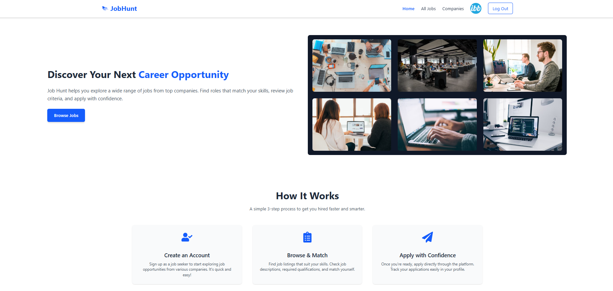
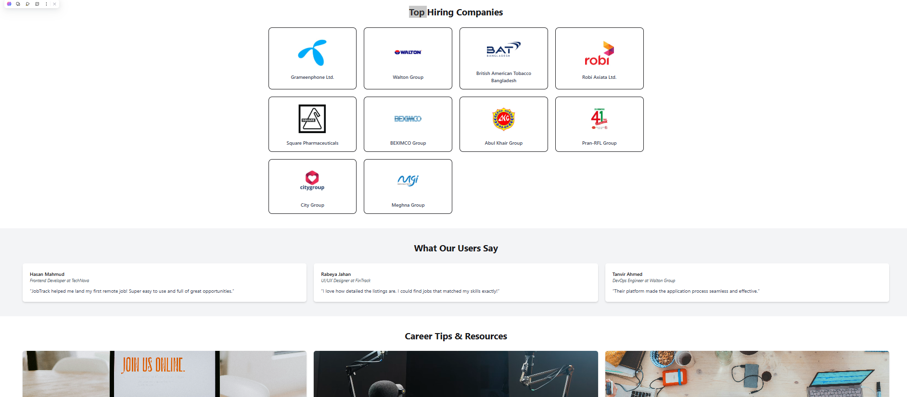

# 💼 JobTrack – Smart Job Portal

🔗 **Live Site**: [https://job-hunt-7328a.web.app](https://job-hunt-7328a.web.app)

🔍 **JobTrack** – A modern and user-friendly job search platform built with **React**, **Firebase**, and **Tailwind CSS**. It enables users to browse companies, view job openings, manage profiles, and apply for jobs directly. This responsive app offers seamless authentication, protected routes, and engaging UI transitions for a professional job-hunting experience.

---

## 📸 Screenshot

  

---

## 🛠️ Technologies Used

- **React**
- **Firebase Authentication**
- **React Router**
- **Tailwind CSS**
- **DaisyUI**
- **Framer Motion**
- **React Icons**
- **React Toastify**
- **Vite**

---

## ✨ Key Features

- 🔐 **Authentication**
  - Email/password sign-up & login
  - Google social login
  - Forgot password with Gmail reset link
  - Dynamic navbar based on login state

- 🔒 **Private Routes**
  - Company details and profile pages require authentication

- 🏢 **Job Listings**
  - Browse companies from JSON
  - View detailed company and job info
  - Apply via external company job links

- 👤 **Profile Management**
  - View and update name & profile picture
  - Managed securely via Firebase

- 🌐 **Navigation & UI**
  - 404 page for unknown routes
  - Custom route titles
  - Responsive header/footer
  - Framer Motion animations

- 📱 **Fully Responsive**
  - Optimized for desktop, tablet, and mobile devices

---

## 📦 Frontend Dependencies

| Package                | Version     |
|------------------------|-------------|
| **react**              | ^19.1.0     |
| **react-dom**          | ^19.1.0     |
| **react-router**       | ^7.6.2      |
| **firebase**           | ^11.9.1     |
| **tailwindcss**        | ^4.1.10     |
| **daisyui**            | ^5.0.43     |
| **framer-motion**      | ^12.18.1    |
| **motion**             | ^12.18.1    |
| **react-icons**        | ^5.5.0      |
| **vite**               | ^6.3.5      |
| **@vitejs/plugin-react** | ^4.4.1   |
| eslint, postcss, etc.  | for tooling |

---

## 🧑‍💻 Development Setup
git clone https://github.com/your-username/jobtrack.git
cd jobtrack
npm install

Create a .env file in the root directory and add:
VITE_apiKey=your_api_key
VITE_authDomain=your_auth_domain
VITE_projectId=your_project_id
VITE_storageBucket=your_storage_bucket
VITE_messagingSenderId=your_messaging_sender_id
VITE_appId=your_app_id

npm run dev     # Start development server
npm run build   # Build for production

🔗 Links & Resources
🌐 Live Site

📁 Client GitHub Repo: your-repo-link-here

🔥 Firebase Docs

💡 Vite Docs

❤️ Feel free to fork, contribute, or enhance this app to support more job seekers!
